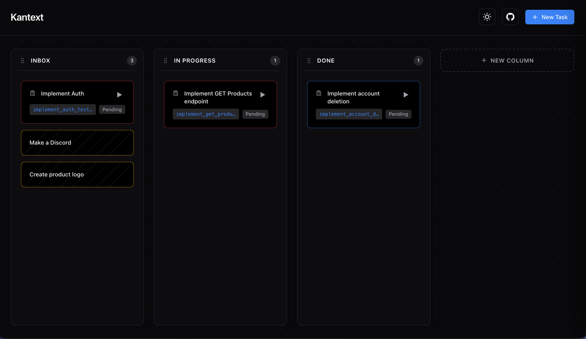

# Kantext

A TDD-focused Kanban board that tracks tasks alongside their tests, stores everything in a Markdown file, and provides an MCP server for direct LLM access.



## Features

- MCP server for AI assistant integration
- Tasks stored in a simple Markdown file
- Visual Kanban board with drag-and-drop
- Auto-generates Go test files for new tasks
- Runs tests and tracks pass/fail status
- Real-time updates via WebSocket

## Quick Start

```bash
# Build
make build-all

# Run the web server
./bin/kantext -port 8081

# Open http://localhost:8081
```

## Usage in Your Project

1. **Copy the binary** to your project or add to PATH:
   ```bash
   cp bin/kantext /usr/local/bin/
   ```

2. **Run from your project root**:
   ```bash
   cd /path/to/your/project
   kantext
   ```

   This creates:
   - `TASKS.md` - Your task list (commit this!)
   - `tests/` - Generated test files

3. **Or use a config file** (`config.json`):
   ```json
   {
     "working_directory": "/path/to/your/project",
     "tasks_file": "TASKS.md"
   }
   ```

   Then run:
   ```bash
   kantext -config /path/to/config.json
   ```

## MCP Server (for Claude, etc.)

Add to your MCP config (e.g., `.mcp.json`):

```json
{
  "mcpServers": {
    "kantext": {
      "command": "/path/to/kantext-mcp",
      "args": ["-config", "/path/to/your/project/config.json"]
    }
  }
}
```

Available tools:
- `list_tasks` - View all tasks
- `create_task` - Create a new task with auto-generated test
- `run_test` - Run a task's test
- `move_task` - Move task between columns
- `get_task` - Get task details
- `delete_task` - Delete a task

## Build

```bash
make build        # Build web server
make build-mcp    # Build MCP server
make build-all    # Build both
make clean        # Remove binaries
make run          # Run web server
```

## License

MIT
